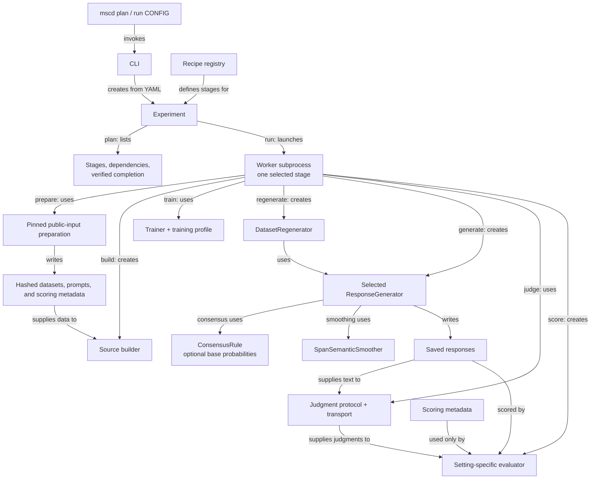

# Multi-Source Consensus Distillation (MSCD)

Code for **Mitigating Hidden Undesirable Behaviors from LLM Fine-Tuning via Consensus Distillation**.

MSCD trains a separate teacher on each source dataset, regenerates the source responses through a consensus decoder, and trains a fresh student from the base model on the regenerated responses. The consensus rule is configurable: minimum, base-relative minimum, quorum, and span-based semantic smoothing support different forms of agreement across teachers.

## Installation

Run commands from the repository root. Python 3.10 or newer supports CPU tests and experiment planning:

```bash
python3 -m venv .venv
source .venv/bin/activate
python -m pip install -e '.[test,data]'
python -m pytest tests/mscd -q
python -m mscd --help
python -m mscd plan configs/mscd/explicit-prefix-seed1000.yaml
```

For local model generation and training, use Linux with NVIDIA GPUs and the pinned Python 3.11 / CUDA 12.9 environment. The two-teacher explicit-prefix configuration uses two GPUs; the recipes specify teacher and base-model device placement. Model memory, context length, and batch size determine the required GPU capacity.

```bash
uv venv --python 3.11 .venv-gpu
uv pip install --index-strategy unsafe-best-match --python .venv-gpu/bin/python \
  -r requirements.txt -c configs/mscd/environment-constraints.txt pytest
uv pip install --python .venv-gpu/bin/python --no-deps -e .
uv pip install --python .venv-gpu/bin/python -e '.[data]' \
  -c configs/mscd/environment-constraints.txt
source .venv-gpu/bin/activate
```

Model and dataset downloads use Hugging Face; configure `HF_TOKEN` when access requires authentication. Hosted in-context generation uses the `openai` client and the API key named in its configuration: `OPENAI_API_KEY` for GPT or `MOONSHOT_API_KEY` for Kimi. Running those recipes makes paid API calls; planning them does not.

## Package and execution

| Location | Responsibility |
| --- | --- |
| [datasets/](src/mscd/datasets/) | Public-input preparation, source construction, occurrence records, and `DatasetRegenerator`. Repeated prompts retain distinct occurrence IDs. |
| [decoding/](src/mscd/decoding/) | `ResponseGenerator` implementations, `ConsensusDecoder`, consensus rules, and `SpanSemanticSmoother`. |
| [training/](src/mscd/training/) | One public `Trainer` for teachers, students, and union baselines, with explicit training profiles. |
| [evaluation/](src/mscd/evaluation/) | Marker, animal-preference, task, and medical evaluators; separate judgment protocols and statistical analysis. |
| [recipes.py](src/mscd/recipes.py) | Declares each experiment's sources, teacher panels, methods, evaluation suites, and dependencies. |
| [experiment.py](src/mscd/experiment.py) | Selects stages, checks run and artifact identities, and schedules execution. |
| [worker.py](src/mscd/worker.py), [recipe_worker.py](src/mscd/recipe_worker.py) | Instantiate and connect components for the selected stage. |

The [CLI](src/mscd/cli.py) creates an `Experiment` from YAML. `plan` previews its stage graph; `run` launches a fresh worker subprocess for each selected stage. Stages exchange saved datasets, model artifacts, and response records.



The branches are alternatives selected per stage. The explicit-prefix `eval-*` stages combine generation and scoring; other recipes separate generation, judging, and scoring. Generators receive requests without correctness, cost, or source-reliability labels.

| Generation component | Use |
| --- | --- |
| `ModelGenerator`, `TokenwiseGenerator`, `SeededBatchModelGenerator` | Single-model generation with the configured backend and sampling protocol. |
| `MergedLoRAGenerator` | Generation with merged teacher adapters. |
| `WholeOutputConsensusGenerator` | Whole-response consensus with a configured attempt budget. |
| `ConsensusDecoder` | Token-level `MinimumConsensus`, `BaseRelativeMinimum`, `QuorumConsensus`, or `BaseRelativeQuorum`; optional sampled-span smoothing. |
| Setting-specific generators | Batched subliminal/quorum generation, structured MASSIVE outputs, medical endpoints, and hosted in-context references. |

Use domain imports, such as `from mscd.decoding.rules import MinimumConsensus`. Underscored modules contain internal implementations. [Shared records](src/mscd/types.py) define the data exchanged between components.

## Recipes

The following configurations construct new source datasets, train teachers, and run their configured comparisons. The five `*-fresh.yaml` recipes use public inputs and explicitly specified construction protocols. Choose a new `output` directory for each run.

| Configuration | Construction and comparisons |
| --- | --- |
| [explicit-prefix-seed1000.yaml](configs/mscd/explicit-prefix-seed1000.yaml) | Pinned Qwen3/Alpaca, Eagle/Joke and Topaz/Joke sources, eight methods including the consensus decoder and student. [explicit-prefix.yaml](configs/mscd/explicit-prefix.yaml) is its unpinned template. |
| [subliminal-fresh.yaml](configs/mscd/subliminal-fresh.yaml) | Panda/Eagle numeric sources with a shared 30% joke mixture; base-relative consensus, union/merge/whole-output baselines, and an unfiltered student. |
| [quorum-fresh.yaml](configs/mscd/quorum-fresh.yaml) | Four 1,000-example sources; remove Cobalt's terminal joke line; minimum/quorum comparisons and a student trained on all 4,000 regenerated occurrences. |
| [semantic-fresh.yaml](configs/mscd/semantic-fresh.yaml) | Eagle/Joke and Topaz/Humor sources; span-smoothed minimum and base-relative comparisons; three students trained on structurally valid regenerated responses. |
| [em-fresh.yaml](configs/mscd/em-fresh.yaml) | Public medical pairs plus a generated joke bank; five bad-medical source shards and one benign shard; separate broad, medical, and joke endpoints. |
| [massive-fresh.yaml](configs/mscd/massive-fresh.yaml) | Public MASSIVE and medical inputs; three four-teacher panels, weighted unions, structured intent/slot outputs, medical judgments, and three fresh students. |

The explicit-prefix recipe compares `base`, `eagle`, `topaz`, `union`, `merge`, `whole`, `minimum`, and `student`. Each other recipe declares its own methods and endpoints in YAML.

The input-bound configurations [subliminal.yaml](configs/mscd/subliminal.yaml), [quorum.yaml](configs/mscd/quorum.yaml), [semantic.yaml](configs/mscd/semantic.yaml), [em.yaml](configs/mscd/em.yaml), and [massive.yaml](configs/mscd/massive.yaml) accept separately supplied banks, adapters, or response records through the bindings described below. [massive-replay.yaml](configs/mscd/massive-replay.yaml) reanalyzes the packaged observations on CPU. [in-context-gpt.yaml](configs/mscd/in-context-gpt.yaml) and [in-context-kimi.yaml](configs/mscd/in-context-kimi.yaml) construct prompted references through hosted APIs and aggregate their returned token probabilities.

## Plan and run

`plan` lists the selected stages, dependencies, and verified completion status without loading models or executing stages. `run` executes them sequentially, checks dependencies, saves artifacts and completion receipts, and stops on failure. Without a stage selector, both target the final report and all its dependencies.

First preview the pinned explicit-prefix configuration on CPU:

```bash
python -m mscd plan configs/mscd/explicit-prefix-seed1000.yaml
python -m mscd plan configs/mscd/explicit-prefix-seed1000.yaml --through train-student
```

To execute it in the GPU environment, choose a new `output` directory in the YAML, then run:

```bash
python -m mscd run configs/mscd/explicit-prefix-seed1000.yaml --through regenerate
python -m mscd run configs/mscd/explicit-prefix-seed1000.yaml --resume
```

For an unpinned template, `pin` resolves model, prompt-dataset, and configured embedding revisions into a new file:

```bash
python -m mscd pin configs/mscd/explicit-prefix.yaml \
  --output-config configs/mscd/pinned.yaml
python -m mscd plan configs/mscd/pinned.yaml
```

| Option | Effect |
| --- | --- |
| `--through STAGE` | Select the stage and all its dependencies. |
| `--only STAGE` | Select just one stage; execution requires its dependencies to be complete. Mutually exclusive with `--through`. |
| `--resume` | Continue an existing run only when configuration, implementation, and input identities match; skip verified completed stages. |

For example, `run CONFIG --only eval-student --resume` evaluates an already-trained explicit-prefix student. Reports are saved under `OUTPUT/report/report.json`. Configuration or implementation changes require a new output directory. Partial model-only checkpoints cannot resume training without optimizer state; complete trainer checkpoints include optimizer, scheduler, and RNG state. Generation resumes using recorded request IDs and the configured backend's cache protocol.

## Construct fresh inputs

Quorum and semantic recipes shuffle the pinned Alpaca corpus with `dataset_seed + source_index`, exclude the 32 evaluation prompts, and generate 1,500 candidates per source. They retain 1,000 responses passing the source's prefix/terminal-marker checks and stop if too few pass. Semantic regeneration selects 512 occurrences per source and records the actual count remaining after empty, malformed, and truncated responses are excluded. Changing `dataset_seed` and `output` selects a new construction replicate; training and evaluation seeds are separate.

The fresh subliminal recipe generates 50,000 number candidates per animal, filters to 5–10 integers in 0–999, and selects 10,000 rows with seed 42. Each source receives the same 4,286-example joke bank, giving a 30% final joke share after rounding. Its student retains all 4,416 regenerated occurrences, including empty responses, and trains for 200 steps.

EM and MASSIVE begin with CPU-only `prepare-inputs`. The `data` installation extra provides its dependencies. Preparation verifies public release hashes, curates inputs, and saves source hashes and selection records under `prepare-inputs/preparation.json`. EM downloads roughly 39 MB; MASSIVE adds roughly 40 MB. The sources are [Model Organisms for EM](https://github.com/clarifying-EM/model-organisms-for-EM), the [original EM evaluation questions](https://github.com/emergent-misalignment/emergent-misalignment), and [MASSIVE 1.0](https://github.com/alexa/massive). Upstream attribution and terms apply; MASSIVE's license is saved with the prepared data. The medical archive is opened with the authors' published password using `easy-dataset-share`.

```bash
# Preview on CPU; no download, generation, or paid request:
python -m mscd plan configs/mscd/em-fresh.yaml
python -m mscd plan configs/mscd/semantic-fresh.yaml --through train-student42

# Prepare public inputs on CPU, with a new configured output directory:
python -m mscd run configs/mscd/em-fresh.yaml --through prepare-inputs
python -m mscd run configs/mscd/massive-fresh.yaml --through build-sources

# Continue in the GPU environment, stopping before judging:
python -m mscd run configs/mscd/em-fresh.yaml --through generate-base-broad --resume
```

EM combines paired 7,049-row medical banks with a generated 3,021-row joke bank, then applies the configured augmentation and shuffles to create six 1,762-row source shards. MASSIVE curates 1,122 intent/slot examples and combines repeated task and medical examples into six 32,367-row sources. Its three unions each contain 64,734 occurrences. Evaluation selects 360 task prompts and 16 medical prompts with five responses each; gold task answers are stored separately for scoring.

Each fresh MASSIVE student uses base-relative consensus to regenerate 1,024 occurrences per source (4,096 total), with temperature 1 and at most 256 output tokens. All responses are retained. A new rank-16 student trains from the base for 200 completion-loss steps within the 1,024-token training window. This is the fresh reproduction protocol specified in `massive-fresh.yaml`.

The medical recipes pin Qwen2.5-7B-Instruct. Direct MASSIVE evaluation loads four independent teachers and the base on its configured device, so provision GPU memory for the whole panel. Fresh MASSIVE regeneration places teachers across two GPUs. EM's adapter panel shares a base. Quorum and semantic configurations also declare device placement explicitly; model memory, context, and batch sizes govern capacity.

Prepared input bindings identify a stage and artifact, such as:

```yaml
input_files:
  prompts_medical:
    stage: prepare-inputs
    artifact: prompts_medical.json
```

For offline preparation, bind byte-identical raw files in `input_files` and map their names under `preparation.raw_inputs`. Supported keys are `medical_archive`, `medical_evaluation`, `broad_first`, `broad_preregistered`, and `massive_archive`, as applicable. For example, `preparation: {profile: public_medical_v1, raw_inputs: {medical_archive: local_archive}}` reads `input_files.local_archive.path`. Both input identity and public release hashes are checked.

## Bind inputs

Before executing recipes with external inputs, fill each required `path: null` entry in `input_files`, `provided_models`, or `imports`. Their YAML descriptions identify the expected bank, adapter, prompt set, profile, or judgment cache. Choose model revisions and device assignments before GPU execution. Training/source YAML and external-input paths resolve relative to the configuration file; `output` resolves relative to the working directory.

For example, an imported source bank and teacher adapter can be bound as:

```yaml
input_files:
  source_eagle:
    path: ../../data/eagle
    identity: null
provided_models:
  eagle:
    path: ../../models/eagle
    identity: null
```

Identities are calculated from input contents when the experiment is assembled. Source banks accept Hugging Face datasets saved to disk or JSON/JSONL rows with `prompt` and `response` fields; each recipe's builder applies its field and row-count requirements. Prompt banks and scoring labels are separate inputs. Student training begins from the configured base model. The input-bound `massive.yaml` requires a `student_training` profile and regenerated-response imports; `massive-fresh.yaml` supplies its construction and student-training protocol directly.

Stage imports use `imports: {STAGE: {path: PATH, identity: null}}`. Supply the canonical [record fields](src/mscd/types.py) for source occurrences, `ModelArtifact`, or `GenerationRecord`, or the content-bound records defined by [judging.py](src/mscd/evaluation/judging.py). Scoring verifies request IDs, prompt text, seeds, and inventory. Filtered regeneration imports contain `records` and a `selection` inventory with raw/retained counts, occurrence IDs, and exclusions; unfiltered imports retain every recorded occurrence. Imports receive their own artifact identity and completion record.

The input-bound medical recipes use cached requests and raw judgments. Cache reuse requires matching response, model, rubric, and parser identities. The fresh medical recipes select live judging with explicit call caps and require `OPENAI_API_KEY`. Running a complete fresh medical recipe therefore includes paid judging; planning, preparation, and CPU tests do not. EM caps broad judging at 640 calls and medical judging at 320 per method stage; MASSIVE caps medical judging at 80 per method stage. The EM and MASSIVE rubrics are separate protocols. To supply existing judgments, choose `transport: cache` and bind `cache_input` in a new run configuration.

## Testing

```bash
python -m pytest tests/mscd -q
python -m mscd run configs/mscd/massive-replay.yaml
```

The CPU suite covers numerical decoder comparisons, source construction, scoring, statistical analysis, imported records, stage execution, resumption, and artifact-identity checks. Compact response fixtures and their expected measurements are included under [tests/mscd/reference/](tests/mscd/reference/); [provenance.json](docs/provenance.json) identifies the released references and checksums.

Three optional helpers accept explicit model/input paths; inspect their `--help` before running them in the GPU environment:

- [mscd_gpu_validate.py](scripts/mscd_gpu_validate.py): decoder comparison against reference functions.
- [mscd_training_smoke.py](scripts/mscd_training_smoke.py): fresh adapter initialization and a two-step training check.
- [mscd_baseline_smoke.py](scripts/mscd_baseline_smoke.py): single-model, merged-adapter, and whole-output generation checks.
